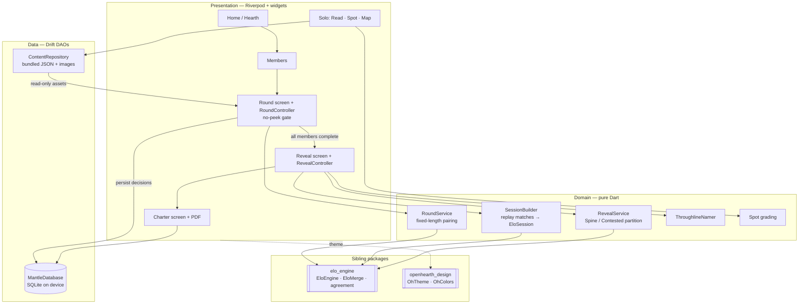

# Architecture overview

How Mantle fits together. For *why* the load-bearing choices were made, see
[the ADRs](../adr/); for the reveal math, the [yellow paper](../spec/yellow-paper.md).

## The shape

Mantle is a Flutter app in **Clean Architecture**: each feature is a slice of
`domain` (pure Dart, no Flutter, no Drift), `data` (Drift DAOs), and
`presentation` (Riverpod controllers + widgets). State flows through Riverpod;
persistence is a single local Drift/SQLite database; two sibling packages supply
the ranking math (`elo_engine`) and the shared theme (`openhearth_design`).

## The data flow, end to end

1. **Gather.** `MembersDao` stores 2–5 members (label + colour). A `Round` row is
   created with the current `deckVersion`.
2. **Rank.** For each member × domain, `RoundController` drives a `RoundService`
   (which wraps an `EloEngine`) through a **fixed 12 decisions**. Each decision is
   written to `RankingMatches` as an outcome row (`aWins` / `bWins`). Skips don't
   count. Between members a hand-off interstitial shows; no results are visible.
3. **Gate.** The reveal route is unreachable until `allMembersComplete` is true
   (all non-removed members have all three domain sessions complete). This gate —
   not the merge math — is what makes the reveal require ≥ 2 rankers.
4. **Rebuild.** `RevealController` loads every session's match rows and replays
   them through `SessionBuilder.buildSession`, reconstructing an immutable
   `EloSession` per member per domain. Persistence stores *decisions*, not
   ratings, so the ranking is always a pure function of recorded history.
5. **Merge & partition.** Per domain, `RevealService.compute` calls
   `EloMerge.combine(..., harmonicMean)` and partitions the merged items into the
   **Spine** (agreement ≥ 0.75 *and* above the domain midpoint) and **Contested**
   (agreement ≤ 0.25), with a fallback when too few qualify. See the
   [yellow paper](../spec/yellow-paper.md).
6. **Name.** `ThroughlineNamer` names the cross-domain threads the Spine expresses
   (≥ 2 Spine items spanning ≥ 2 domains).
7. **Charter.** The family edits a House name / motto; `charter_pdf.dart` renders
   a printable one-pager. The `Charters` row stores the Spine/Contested item ids,
   named through-lines, and any body overrides.

## Module map — where to look

| Concern | Files |
|---|---|
| **App entry / theme** | `lib/main.dart`, `lib/app/app.dart`, `lib/core/theme/theme_preference.dart` |
| **Database + connection** | `lib/core/db/database.dart`, `lib/core/db/connection/` (native/web split), `lib/core/providers.dart` |
| **Bundled content** | `lib/features/content/` (domain + `ContentRepository`), `assets/data/*.json`, `assets/images/deck/`, `assets/plates/` |
| **Ranking round** | `lib/features/ranking/domain/` (`round_service`, `session_builder`, `round_models`), `.../data/*_dao.dart`, `.../presentation/round_controller.dart` |
| **Reveal + Charter** | `lib/features/reveal/domain/` (`reveal_service`, `reveal`, `throughline_namer`), `.../presentation/` (`reveal_controller`, `charter_screen`, `charter_pdf`) |
| **Solo depth** | `lib/features/solo/` (Read / Spot / Map, `spot_grading.dart`, progress DAOs) |
| **Shared widgets** | `lib/widgets/` (`plate.dart`, `activity_card.dart`, `error_view.dart`, …) |
| **Ranking + merge math** | **`elo_engine`** sibling package (`EloEngine`, `EloMerge`, `agreement`) — *not* in this repo |

## Layer boundaries (the ones that matter)

- **Domain is pure.** `RoundService`, `SessionBuilder`, `RevealService`,
  `ThroughlineNamer` take plain Dart in and out. `MatchRow` (in `round_models.dart`)
  is a deliberate Drift-free DTO so the reveal logic is unit-testable with no
  database. Don't leak Drift types into the domain layer.
- **The merge lives elsewhere.** Agreement and combined-score are defined in
  `elo_engine`; Mantle *consumes* them and owns only the partition and naming on
  top. If you're changing "how a shared favourite is computed," check which side
  of that line you're on.
- **Persistence is decisions, not results.** The database records match outcomes;
  every rating/ranking is derived by replay. This keeps the reveal reproducible
  and makes the (future) sync story a merge of decision logs.
